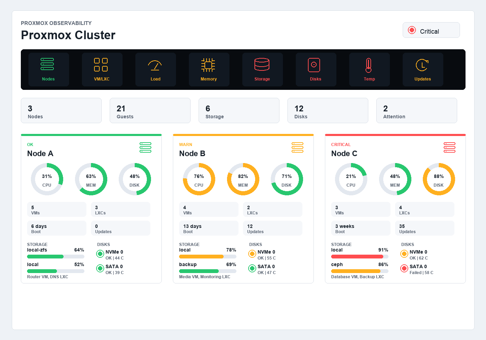

# Proxmox Dashboard Card

A Home Assistant Lovelace custom card for monitoring a Proxmox cluster at a glance. It is designed for three-node homelabs, but the configuration accepts any number of nodes, VMs, LXCs, storage pools, and physical disks.



## Highlights

- Cluster-style warning strip inspired by vehicle and submarine status indicators, with server/computer symbols instead of vehicle symbols.
- Per-node CPU, memory, and disk gauges with green, amber, and red health states.
- Physical disk status with health, temperature, and wearout indicators.
- Storage pool usage bars.
- VM and LXC rows with status dots and compact load bars.
- Visual Lovelace editor for selecting the entities used by each parameter.
- HACS-ready repository layout with the installable card in `dist/proxmox-dashboard-card.js`.

## Installation With HACS

1. Upload this repository to a public GitHub repository, for example `proxmox-dashboard-card`.
2. In Home Assistant, open HACS.
3. Add the GitHub URL as a custom repository and choose the `Dashboard` category.
4. Download the card.
5. If HACS does not add the resource automatically, add this dashboard resource manually:

```yaml
url: /hacsfiles/proxmox-dashboard-card/proxmox-dashboard-card.js
type: module
```

## Lovelace Usage

The easiest setup is through the visual card editor. Add a manual card with:

```yaml
type: custom:proxmox-dashboard-card
```

Then open the visual editor and add your Proxmox entities for each node, disk, storage pool, VM, and LXC.

You can also configure it directly in YAML:

```yaml
type: custom:proxmox-dashboard-card
title: Proxmox Cluster
thresholds:
  cpu:
    warning: 70
    critical: 90
  memory:
    warning: 75
    critical: 90
  disk:
    warning: 75
    critical: 90
  storage:
    warning: 75
    critical: 90
  disk_temperature:
    warning: 50
    critical: 60
  wearout:
    warning: 60
    critical: 85
  updates:
    warning: 1
    critical: 30
nodes:
  - name: Node A
    status_entity: sensor.node_a_status
    cpu_entity: sensor.node_a_cpu_used
    memory_used_percentage_entity: sensor.node_a_memory_used_percentage
    memory_free_entity: sensor.node_a_memory_free
    memory_used_entity: sensor.node_a_memory_used
    disk_used_percentage_entity: sensor.node_a_disk_used_percentage
    containers_running_entity: sensor.node_a_containers_running
    virtual_machines_running_entity: sensor.node_a_virtual_machines_running
    last_boot_entity: sensor.node_a_last_boot
    updates_entity: sensor.node_a_total_updates
    updates_packages_entity: sensor.node_a_update_packages
    storages:
      - name: local-zfs
        used_percentage_entity: sensor.node_a_local_zfs_used_percentage
      - name: backup
        used_percentage_entity: sensor.node_a_backup_used_percentage
    disks:
      - name: NVMe 0
        health_entity: sensor.node_a_nvme0_health
        temperature_entity: sensor.node_a_nvme0_temperature
        wearout_entity: sensor.node_a_nvme0_wearout
        power_on_hours_entity: sensor.node_a_nvme0_power_on_hours
        power_cycles_entity: sensor.node_a_nvme0_power_cycles
        size_entity: sensor.node_a_nvme0_size
    guests:
      - name: Firewall
        type: vm
        status_entity: sensor.vm_firewall_status
        cpu_entity: sensor.vm_firewall_cpu_used
        memory_used_percentage_entity: sensor.vm_firewall_memory_used_percentage
      - name: DNS
        type: lxc
        status_entity: sensor.lxc_dns_status
        cpu_entity: sensor.lxc_dns_cpu_used
        memory_used_percentage_entity: sensor.lxc_dns_memory_used_percentage
```

All entity names above are anonymized examples. Replace them with the entities created by your Proxmox integration.

## Entity Mapping

### Node Fields

- `status_entity`
- `cpu_entity`
- `memory_used_percentage_entity`
- `memory_free_entity`
- `memory_used_entity`
- `disk_used_percentage_entity`
- `containers_running_entity`
- `virtual_machines_running_entity`
- `last_boot_entity`
- `updates_entity`
- `updates_packages_entity`
- `temperature_entity`

### Physical Disk Fields

- `health_entity`
- `temperature_entity`
- `wearout_entity`
- `power_on_hours_entity`
- `power_cycles_entity`
- `size_entity`
- `node_entity`

### VM and LXC Fields

- `status_entity`
- `cpu_entity`
- `memory_used_percentage_entity`
- `disk_used_percentage_entity`
- `uptime_entity`

### Storage Fields

- `status_entity`
- `used_percentage_entity`
- `used_entity`
- `free_entity`
- `total_entity`

If `used_percentage_entity` is not set for storage, the card can calculate usage from `used_entity` and `total_entity` when both are numeric.

## Health Logic

The card combines the configured status entities and thresholds into one overall state:

- Green: values are below warning thresholds and status entities are healthy.
- Amber: values exceed warning thresholds, updates are available, a guest is stopped, or a status reports a warning/degraded state.
- Red: values exceed critical thresholds, a disk reports failed health, or an entity reports offline/failed/unavailable.
- Gray: a category has not been configured or cannot be evaluated yet.

## Development

No build step is required. The shipped card is plain JavaScript.

```bash
npm run check
```

The mock-up source lives in `docs/mockup.html`. Open it in a browser to preview the card with synthetic, anonymized data.
